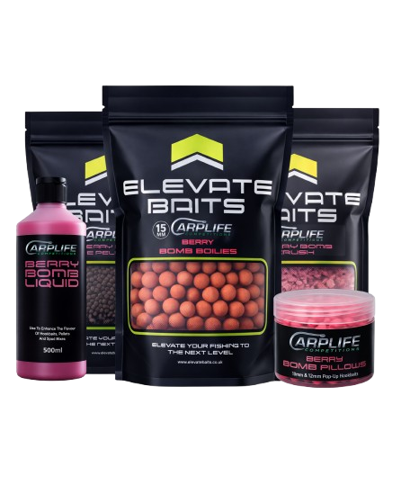

<div align="center">
  

  # River Fisher — Last Man Standing

  **A live tournament draw tool for carp fishing competitions**

  [](https://last-man-standing.netlify.app)
  [](https://react.dev)
  [](https://developer.mozilla.org/en-US/docs/Web/API/Canvas_API)
  [](https://netlify.com)
</div>

---

## Overview

**River Fisher — Last Man Standing** is a fully animated, browser-based tournament draw tool built for carp fishing competitions and live events. A host projects the game on a screen: fish swim beneath a boat, a hook drops at random, and the participant whose fish bites the hook **wins the round**.

Participants are loaded from an Excel spreadsheet, each assigned to a fish in the water. The last angler remaining after all rounds is crowned the winner.

---

## Features

### Live Tournament Draw
- Upload a participant roster via **Excel (`.xlsx`)** — no manual entry needed
- Each participant is assigned a fish that swims in real time
- A hook drops at a random position; the fish that bites wins the round
- Eliminated participants leave the water each round
- **Auto-round mode** automatically advances after a configurable delay

### Rich Visual Environment
| Setting | Options |
|---|---|
| Time of Day | Dawn · Day · Dusk · Night |
| Weather | Clear · Storm |
| Fog density | Adjustable slider |
| Water depth | Shallow · Deep |
| Boat drift | On / Off |
| Lantern | On / Off |
| Fish name labels | On / Off |

### Multiple Fish Species
Six hand-crafted carp species, each with unique colouring and rarity weighting:
- Common Carp · Mirror Carp · Leather Carp
- Ghost Carp · Koi · Grass Carp

Each fish has a fully animated spine-driven body — no sprite sheets, all procedural canvas rendering.

### Audio
- Ambient rain loop
- Background music track
- Master volume control
- Toggle on/off without page reload

### Tweaks Panel
An in-game settings panel lets a host customise every visual and gameplay variable live, without stopping the tournament.

---

## Tech Stack

| Layer | Technology |
|---|---|
| Rendering | HTML5 Canvas API (2D) |
| UI / State | React 18 (CDN UMD build) |
| Roster import | SheetJS (XLSX) |
| Fonts | Fraunces · JetBrains Mono (Google Fonts) |
| Deployment | Netlify |

No build step required — the game runs from a single HTML file and plain JS.

---

## Getting Started

### Run locally

```bash
# Clone the repo
git clone https://github.com/Khaled192/last-man-standing.git
cd last-man-standing

# Open in browser — no build step needed
open game.html
```

> A local server is recommended to avoid CORS issues with audio files:
> ```bash
> npx serve .
> # or
> python3 -m http.server 8080
> ```

### Deploy to Netlify

The repo includes a `netlify.toml` that redirects `/` → `/game.html`.

1. Push to GitHub
2. Connect the repo in the [Netlify dashboard](https://app.netlify.com)
3. Publish directory: `.` (root)
4. No build command needed

---

## Project Structure

```
last-man-standing/
├── game.html          # Entry point
├── game.js            # Main game engine (canvas rendering, fish AI, tournament logic)
├── audio.js           # Audio engine (rain, music, volume control)
├── tweaks-panel.js    # In-game settings panel component
├── styles.css         # Global styles and HUD layout
├── assets/
│   ├── carplife-logo.png
│   └── elevate-baits.png
├── sound/
│   ├── rain.mp3
│   └── music.mp3
└── netlify.toml
```

---

## Sponsors



---

## Part of the Carplife Games Suite

| Game | Description |
|---|---|
| **Last Man Standing** | Live tournament fish draw |
| [Mystery Game — Prize Draw](https://github.com/Khaled192/Mystery-Game) | Underwater peg reveal draw |
| Open The Doors *(coming soon)* | Fishing cabin door prize reveal |

---

<div align="center">
  Made with ❤️ for the carp fishing community by <strong>Carp Life Games</strong>
</div>
